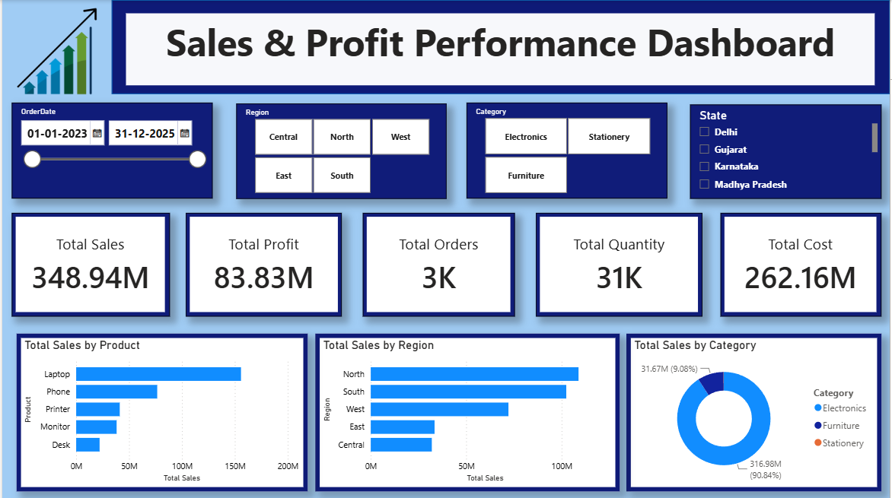
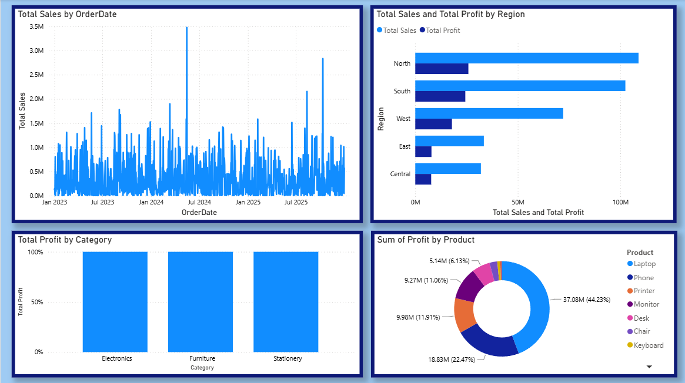

# Sales Profit Performance Analysis

An interactive **Sales and Profit Performance Dashboard** built using SQL and Power BI to analyze sales, costs, profitability, products, customers, discounts, and regional performance.

## 📊 Project Overview

This project analyzes **3,000 sales transactions** to understand overall business performance and identify trends in sales and profitability.

The project follows an end-to-end analytics workflow:

**Dataset → SQL Analysis → Power BI Dashboard → Business Insights**

The analysis focuses on:

- Sales and profit performance
- Product and category performance
- Customer contribution
- Regional and geographical performance
- Discounts and their impact on profitability
- Sales trends over time
- Cost and profitability analysis

The results are presented through an interactive **Power BI dashboard** with KPI cards, charts, filters, and business-focused visualizations.

---

## 🗂️ Dataset

The dataset contains **3,000 sales transactions** and **15 columns**.

### Key Columns

| Column | Description |
|---|---|
| `OrderID` | Unique identifier for each order |
| `OrderDate` | Date on which the order was placed |
| `CustomerID` | Unique customer identifier |
| `CustomerName` | Name of the customer |
| `Product` | Product associated with the order |
| `Category` | Product category |
| `Quantity` | Number of units purchased |
| `UnitPrice` | Price per unit |
| `Discount` | Discount applied to the order |
| `Sales` | Total sales amount |
| `Cost` | Cost associated with the order |
| `Profit` | Profit generated from the order |
| `Region` | Sales region |
| `State` | Customer/order state |
| `City` | Customer/order city |

---

## 🛠️ Tools & Technologies

- **SQL** – Data analysis and business queries
- **Power BI** – Dashboard development and data visualization
- **Power Query** – Data preparation and transformation
- **DAX** – Calculated measures and KPIs

---

## 🗄️ SQL Analysis

SQL was used to analyze the sales dataset and answer key business questions.

The SQL analysis includes:

- Total number of sales transactions
- Total sales, cost, and profit
- Average profit per transaction
- Top-performing products
- Sales and profit by category
- Sales and profit by region
- Top-performing states and cities
- Monthly and yearly sales trends
- Top customers by sales and profit
- Average discount by category
- Discount and profit analysis
- Quantity sold by category
- Products with above-average sales
- Profit margin by category

The complete SQL queries are available in:

**`sql/sales_profit_analysis.sql`**

---

## 📈 Power BI Dashboard

The Power BI dashboard provides an interactive view of sales and profitability performance.

### Dashboard Page 1 – Overview



This page provides an overall view of business performance using key metrics and visualizations.

### Dashboard Page 2 – Profit Analysis



This page focuses on profitability, product/category performance, and detailed business analysis.

---

## 🔍 Key Analysis Areas

### Sales Performance

- Total sales
- Sales trends over time
- Sales by product and category
- Sales by region and location

### Profitability

- Total profit
- Profit by product and category
- Cost vs. sales performance
- Profitability across regions
- Profit margin analysis

### Customer Analysis

- Customer contribution to sales
- Customer-level purchasing patterns
- Identification of high-value customers

### Discount Analysis

- Impact of discounts on sales
- Relationship between discounts and profit
- Discount performance across categories

### Geographic Analysis

- Sales performance by region
- State-level performance
- City-level sales distribution

---

## 📁 Project Structure

```text
Sales Profit Performance Analysis
│
├── data
│   └── sales_profit_performance_data.csv
│
├── sql
│   └── sales_profit_analysis.sql
│
├── dashboard
│   ├── Sales_Profit_Performance_Dashboard.pbix
│   ├── dashboard_page1_overview.png
│   └── dashboard_page2_profit_analysis.png
│
└── README.md